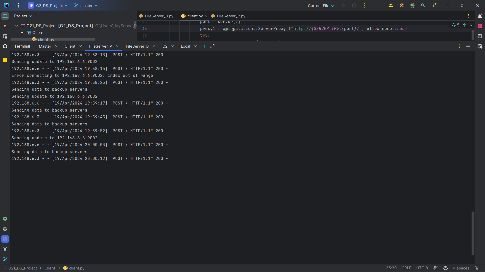

# Remote File Operation System
## IT559 - Distributed Systems Project (Group 2)
This project implements a system for remote file operations, allowing clients to read from and write to files stored on remote servers. The system utilizes distributed architecture to ensure data integrity and availability.

---

## Contents

1. [Introduction](#introduction)
2. [System Overview](#system-overview)
3. [Implementation Details](#implementation-details)
4. [Instructions to Run](#instructions-to-run)
5. [Demo](#demo)
6. [Screenshots](#screenshots)
7. [Contributors](#contributors)
8. [License](#license)

---

## Introduction

This project, developed as part of the IT559 - Distributed Systems course, aims to provide a robust system for remote file operations. It includes components such as a Master Server, Primary File Server, and Backup File Server, each responsible for specific tasks in the file management process.

---

## System Overview

The system architecture consists of the following main components:

- **Master Server**: Coordinates file operations, manages locks, and maintains metadata about servers and files stored.
- **Primary File Server**: Handles file read and write operations for the primary copy of files.
- **Backup File Server**: Stores backup copies of files and synchronizes with the primary server to ensure data integrity.

---

## Implementation Details

The implementation is based on the concept of Remote Procedure Call (RPC) for communication between different components of the system. The system utilizes a primary-backup protocol to ensure sequential consistency and data reliability.

For detailed implementation information, refer to the [Project Documentation](./project_documentation.pdf).

---

## Instructions to Run

### Prerequisites
- Ensure you have Python 3.x installed on your system.
- Make sure you have the necessary permissions to run the servers and client application.

### Setup
1. Clone this repository to your local machine:
```
git clone https://github.com/JaySabva/IT559-G2_Remote_File_Operation.git
```

2. Install the required dependencies using pip:
```
pip install openpyxl xmlrpc
```

### Running the Servers
1. **Master Server**:
- Navigate to the `Master` directory:
  ```
  cd Master
  ```
- Open the `Master.py` file and set the `hostID` variable:
  ```python
  hostID = "<your-ip-address>"  # Set the host IP address here (else set it as localhost)
  ```
- Run the Master Server:
  ```
  python Master.py
  ```

2. **Primary File Server**:
- Navigate to the `FileServer_P` directory:
  ```
  cd FileServer_P
  ```
- Open the `fileserver_P.py` file and set the `hostID` variable:
  ```python
  hostID = "<your-ip-address>"  # Set the host IP address here (else set it as localhost)
  ```
- Run the Primary File Server:
  ```
  python Fileserver_P.py
  ```

3. **Backup File Server**:
- Navigate to the `FileServer_B` directory:
  ```
  cd FileServer_B
  ```
- Open the `fileserver_B.py` file and set the `hostID` variable:
  ```python
  hostID = "<your-ip-address>"  # Set the host IP address here (else set it as localhost)
  ```
- Run the Backup File Server:
  ```
  python fileserver_B.py
  ```

### Running the Client Application
1. **Client**:
- Navigate to the `Client` directory:
  ```
  cd Client
  ```
- Open the `client.py` file and set the `hostID` variable:
  ```python
  SERVER_IP = "<server's-ip-address>"  # Set the host IP address here (else set it as localhost)
  right now, we have hardcoded this ip variables.
  ```
- Run the client application:
  ```
  python client.py
  ```

### Using the Client Application
- Upon running the client application, you'll be prompted with options to perform file operations.
- Choose the appropriate option to write to or read from files stored on the remote servers.
- Follow the on-screen instructions to interact with the system.

### Demo
- For a demonstration of the project in action, check out the YouTube demo [here](https://www.youtube.com/watch?v=your-demo-video-link).

### Screenshots
- **Write Operation - Flow:**

  

- **Read Operation - Flow:**

  

- **Master Server:**

  
- **FileServer_P:**

  
- **FileServer_B:**

  
- **Client:**

  
### Contributors
- Upadhyay Meet Shaileshbhai
- Sabva Jay Dilipbhai
- Thakkar Maulik Mukeshbhai
